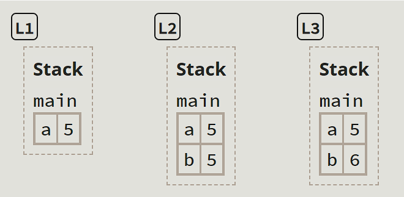
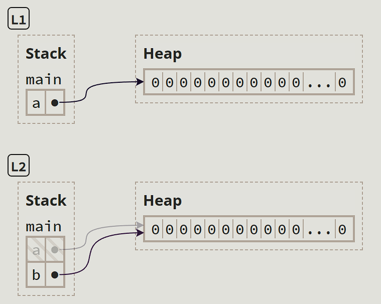
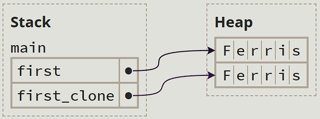

# Ownership

Ownership is rust's most unique feature and enables Rust
to make memory saftey guarantees, without needing a garbage collector.

## But What Is ‘Safety’?
> _Safety is the absence of undefined behavior._
- A foundational goal of Rust is to ensure that your programs never have undefined behavior
    - Undefined behavior is especially dangerous for low-level programs with direct access to memory
- A secondary goal of Rust is to prevent undefined behavior at _compile-time_ instead of _run-time_
    - Avoids bugs in production, improving the **reliability**
    - Fewer runtime checks for bugs, improving the **performance**
- An error like Python's `NameError` comes at a cost: Each time an interpreted program reads a variable, then the interpreter must check whether that variable is defined
- A list of "behavior considered undefined": https://doc.rust-lang.org/reference/behavior-considered-undefined.html
### Case Study: The Morris Worm
https://en.wikipedia.org/wiki/Morris_worm

- One of the key vulnerabilities the worm exploited was a buffer overflow in the `gets()` function in the Unix operating system.
- The `gets()` function was used to read input without checking the length of the input string, allowing more data to be written into the buffer than it could hold.

## Memory Safety
> _Memory is the space where data is stored during the execution of a program._

### Stack
- Variables live in _frames_. A frame is a mapping from variables to values within a single scope, such as a function
- After a function returns, Rust _deallocates_ (_frees_, or _drops_) the function's frame
- The most recent frame added is always the next frame freed (hence the name, _stack_)
- When an expression reads a variable, the variable's value is copied from its slot in the stack frame
    ```rust
    let a = 5; // L1
    let mut b = a; // L2
    b += 1; // L3
    ```
    
    - However, copying data can take a lot of memory (imagine `a` being an array with a million elements)

### Heap
- To transfer access to data without copying it, Rust uses _pointers_. The value that a pointer points-to is called its _pointee_
- One common way to make a pointer is to allocate memory in the _heap_
- The heap is a separate region of memory where data can live indefinitely
- Rust provides a construct called `Box` for putting data on the heap
    ```rust
    let a = Box::new([0; 1_000_000]); // L1 -- `a` is the owner
    let b = a; // L2 -- now `b` is the owner (`a` has been moved)
    ```
    

### Rust Does Not Permit Manual Memory Management!
> _Memory management is the process of allocating and deallocating memory._
- Stacks are automatically managed by Rust
- Heaps are automatically managed by Rust too! If a variable "owns" some data on the heap, when the variable goes out of scope (and is deallocated), then Rust deallocates the relevant heap memory too
- Manual memory management can easily lead to bugs. Suppose we have a `free` function in Rust, similar to C
    ```rust
    let a = Box::new([0; 100]);
    free(a);
    println!("{}", a[0]); // undefined behavior
    ```
- Assignment switches the ownership of a variable. In the statement `let b = a;`, we say that `a` has been _moved_
- The data on the heap can only be accessed through it's **current** owner. This is to prevent undefined behavior
    ```rust
    let empyrean = String::from("Malenia");
    let godess = empyrean; // `godess` is now the owner, but `empyrean` still points to "Malenia"
    godess.push_str(", Godess of Rot"); // new location allocated on the heap, the previous location is invalidated, so `empyrean` now points to an invalid memory location
    println!("{empyrean}"); // undefined behavior; therefore prevented by Rust
    ```
- The `.clone()` method, if implemented for a data structure, can do a _deep copy_, allowing a variable to maintain the ownership of its data during an assignment operation
    ```rust
    let first = String::from("Ferris");
    let first_clone = first.clone();
    ```
    

## References and Borrowing
Using `clone`s can quickly become tedious.
Say a function takes 2 arguments, then we would have to do 2 `clone`
calls.

### References, the Non-owning Pointers
The expression `&x` is used to create a reference to a variable named `x`.
In Rust jargon, the variable `x` is _borrowed_.

<!-- TODO: Add visualization here -->

```rust
let name = String::from("Lucius");
let nickname = &name;
```

In the example above, `nickname` does **not** own either
`name` or `"Lucius"`. Because `nickname` doesn't own them, the
originial variable (`name`) or its value (`"Lucius"`) will not be
deallocated after the deallocation of the reference variable.

> _References are non-owning pointers._

The `*` operator is used for _dereferencing_.

```rust
let x = 10;
let y = &x; // value of `y` is the address of `x`
            // value of `*y` is 10
```

However, Rust implicitly inserts dereferences and references
in certain cases, such as calling a method with the dot operator.

```rust
let x = Box::new(1);
let p = &x; // `p` is a reference to `x`
println("{}, {}", p, *p); // will print `1, 1` -- p is implicitly dereferenced
```

- This implicit conversion works for multiple layers of pointers
- This conversion also works the opposite direction. The function `str::len` expects a reference `&str`. If you call `len` on an owned `String`, then Rust will insert a single borrowing operator
